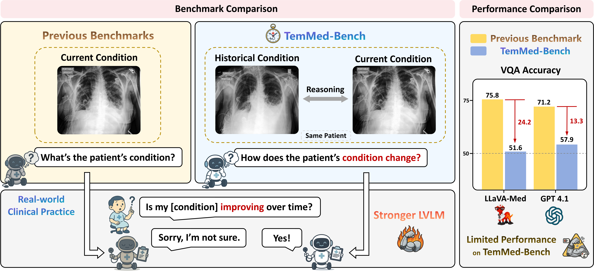
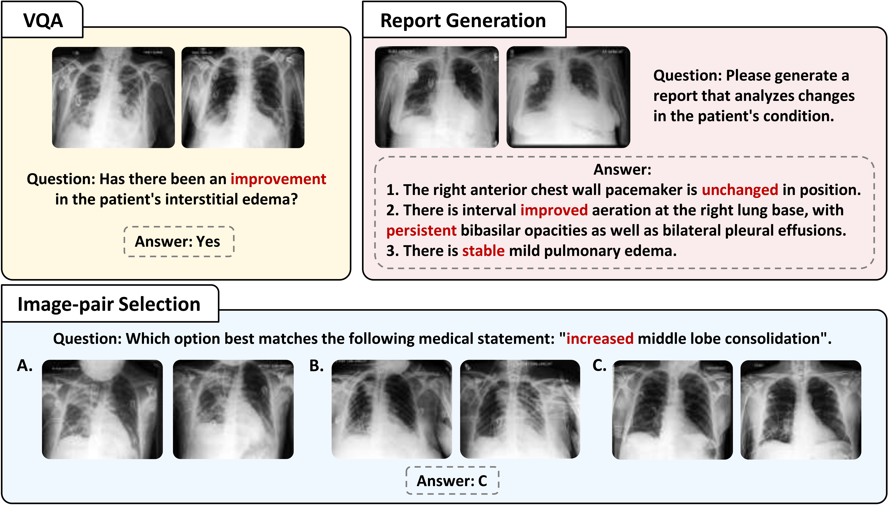
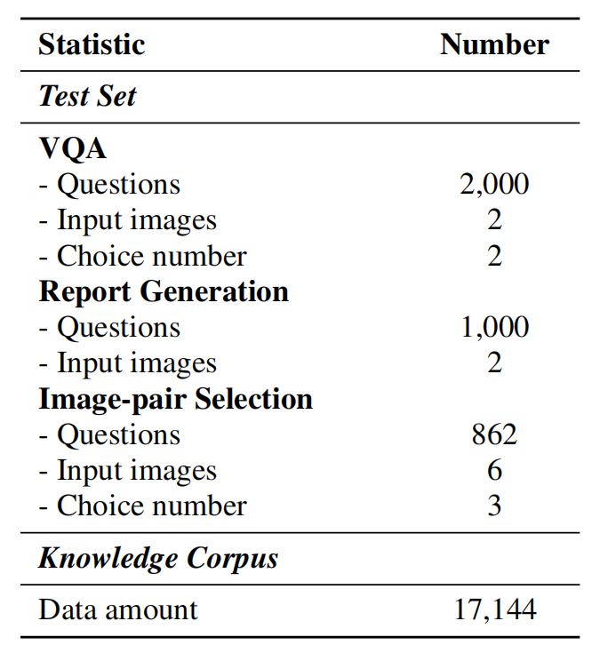
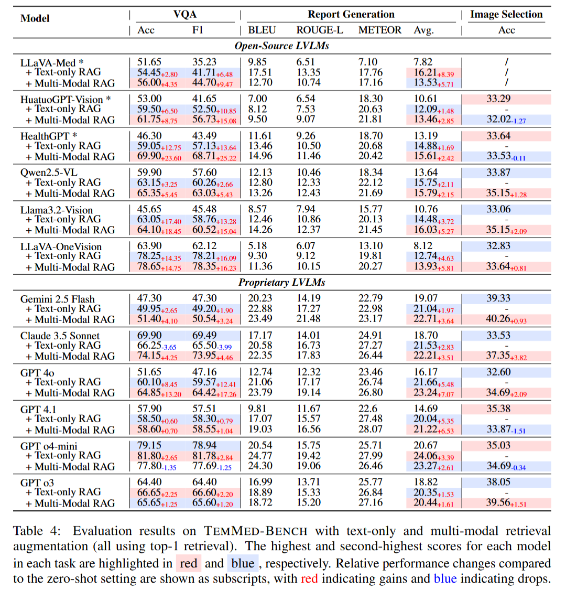

# TemMed-Bench: Evaluating Temporal Medical Image Reasoning in Vision-Language Models

[**🌐 Homepage**](https://temmedbench.github.io/) | [**🤗 Dataset**](https://huggingface.co/datasets/uclanlp/TemMed-Bench) | [**📖 Paper**](https://arxiv.org/abs/2509.25143)

## News

* 🔥 [2024-10-11] Code to be uploaded.

## Intro

TemMed-Bench features three primary highlights. 
- **Temporal reasoning focus:** Each sample in TemMed-Bench includes historical condition information, which challenges models to analyze changes in patient conditions over time.
- **Multi-image input:** Each sample in TemMed-Bench contains multiple images from different visits as input, emphasizing the need for models to process and reason over multiple images.
- **Diverse task suite:** TemMed-Bench comprises three tasks, including VQA, report generation, and image-pair selection. Additionally, TemMed-Bench includes a knowledge corpus with more than 17,000 instances to support retrieval-augmented generation (RAG).

## Benchmark Overview

- **Examples of the three tasks in TemMed-Bench:**

- **Key statistics of TemMed-Bench:**

<!-- 
## Results

- We conducted extensive experiments on TemMed-Bench to evaluate six proprietary and six open-source LVLMs. The results show that most LVLMs lack the ability to analyze changes in patients’ conditions across temporal medical images. 

  - In the VQA task, GPT-4o-mini and Claude 3.5 Sonnet achieved accuracies of 79.15% and 69.90%, respectively, while most LVLMs scored below 60\%. For the more challenging tasks of report generation and image-pair selection, all LVLMs underperformed, with the highest average BLEU, ROUGE-L, and METEOR score at 20.67 for report generation and a top accuracy of 39.33% for image-pair selection in a three-option setting. These results reveal a fundamental gap in current LVLM training, i.e., lack of focus on temporal image reasoning.

- Given the limited performance of current LVLMs in tracking condition changes under the zero-shot setting, we adopt the Retrieval-Augmented Generation (RAG) framework for evaluation. In addition to augmenting the input with retrieved textual information, we further explore augmenting the input with both retrieved visual and textual modalities in the medical domain. 

  - Experimental results demonstrate that augmenting input with both visual and textual information substantially boosts performance for most models compared to text-only augmentation. Notably, HealthGPT exhibits an accuracy improvement of over 10% in the VQA task when augmented with multi-modal retrieved information. These results confirm that multi-modal retrieval augmentation provides more relevant medical information by retrieving images with similar conditions, highlighting its potential for input augmentation in the medical domain.
 -->

## Load Dataset

- Note that due to the CheXpert Plus dataset’s license, we can only release the corresponding data index in our benchmark files. The source data files should be downloaded directly from the [Stanford AIMI dataset page](https://stanfordaimi.azurewebsites.net/datasets/5158c524-d3ab-4e02-96e9-6ee9efc110a1)

- Coming Soon

## Evaluation 

- Coming Soon

## Contact

* Junyi Zhang: JunyiZhang2002@g.ucla.edu

## Citation

- Coming Soon
